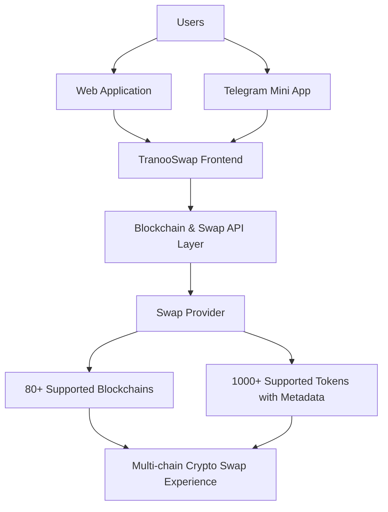

# TranooSwap

## Multi-chain Crypto Swap Infrastructure

Public repository for TranooSwap issues, discussions, documentation, and project communication.

🌐 Live application: https://swap.tranoo.com/

---

## Overview

TranooSwap is a multi-chain cryptocurrency swap application designed to provide a unified swap experience across many blockchain networks.

The product integrates blockchain ecosystems, token metadata, swap providers, and user-facing Web3 interfaces into a single application layer.

## Key Metrics

* 🌍 80+ supported blockchain networks
* 🪙 1000+ supported tokens
* 📱 Web application + Telegram Mini App experience
* 🔗 Multi-chain crypto infrastructure

---

## Architecture

---

## Core Capabilities

* Multi-chain asset discovery
* Token metadata aggregation
* Swap provider integration
* Cross-chain user workflow orchestration
* Web3 frontend integration
* Telegram Mini App integration

---

## Status

TranooSwap is an independently developed crypto infrastructure project focused on multi-chain swap accessibility.

Designed and developed as a product initiative combining Web3 integrations, crypto APIs, and user-facing blockchain workflows.

---

## Engineering Focus

TranooSwap involves:

* Multi-chain blockchain integration
* Crypto asset swap workflows
* Web3 application architecture
* Web3 user interface engineering
* Crypto product engineering
* API integrations with blockchain services
* Production-oriented reliability considerations

Technology stack:

* TypeScript / Vue / Quasar
* Telegram Mini Apps
* Web3 APIs
* Vercel deployment ecosystem
* External crypto service integration

---

## Why This Repository Exists

This repository is the public communication layer for TranooSwap:

* issue tracking
* feature discussions
* community feedback
* documentation references

The core product implementation is maintained separately.

---

## Related Links

* Live application: https://swap.tranoo.com/
* Telegram: https://t.me/TranooSwapBot
* Issues: https://github.com/tranoo/exchange-public/issues
* Discussions: https://github.com/tranoo/exchange-public/discussions

---

## Engineering Background

Created by an engineer focused on:

* blockchain infrastructure
* distributed systems
* backend reliability
* production debugging
* building complex systems across software layers
